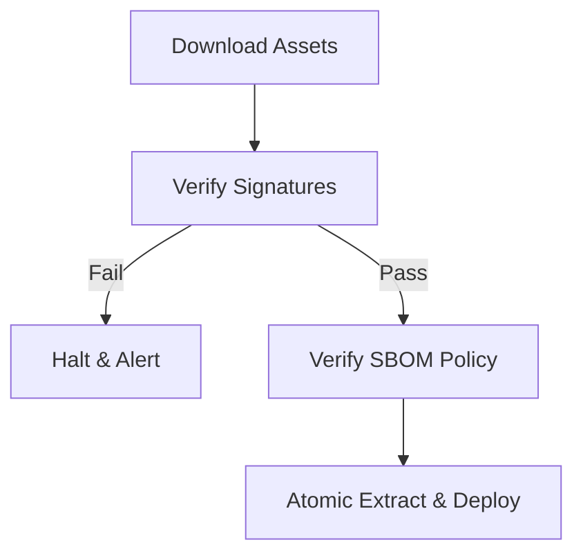

#deploy.md
Focused on the Gatekeeper concept—deployment should fail if verification fails.

# Deploy process

> Generated: {{DATE}}
> Version: {{VERSION}}
> Commit: {{COMMIT_REF}}

## Deploy flow

Signed build
↓
Supply Chain Verification
↓
Deploy
