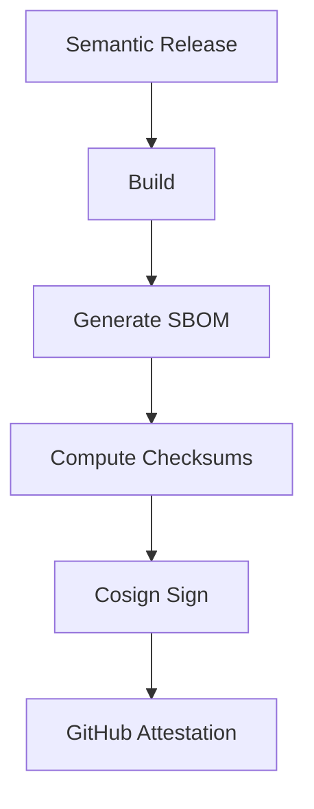

#release.md

## Release Process

> Generated: {{DATE}}
> Version: {{VERSION}}
> Commit: {{COMMIT_REF}}

## Release Flow

Source
↓
Build
↓
SBOM
↓
Checksums
↓
Cosign Signature
↓
SBOM Attestation
↓
Build Provenance
↓
GitHub Release
↓
Generate workflow summary

## Attestation/Provenance

GitHub Build Provenance attestation is generated during release.
Use github actions/attest.

## Release Assets

Build artifact
SBOM
Checksums
Signature bundles
