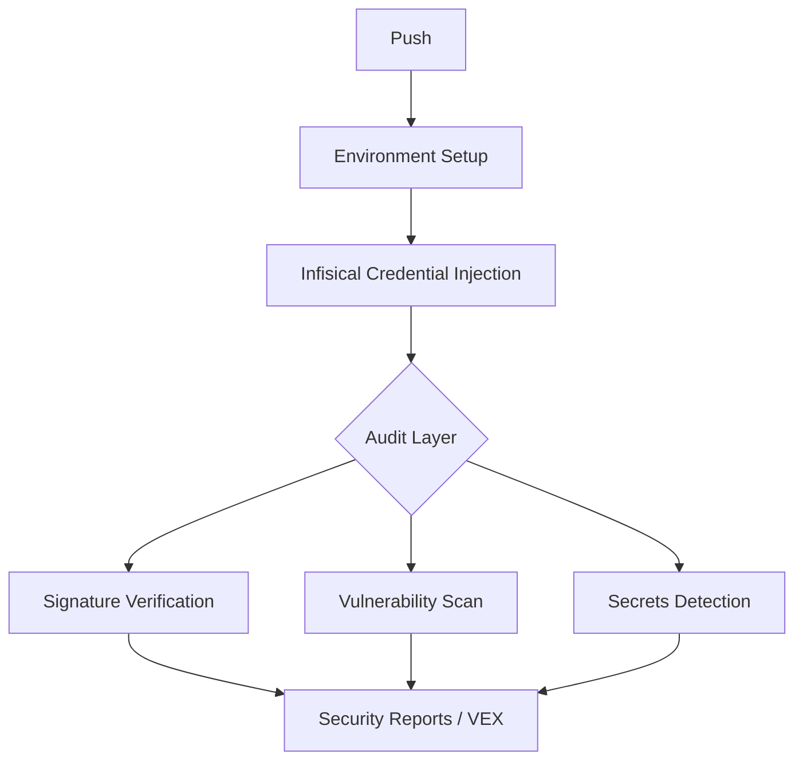

#security.md

## Security Architecture

> Generated: {{DATE}}
> Version: {{VERSION}}
> Commit: {{COMMIT_REF}}

## Overview

This project implements layered supply-chain security controls.
Follow SLSA 3 guidelines.

## Security Controls

- Secret scanning (Gitleaks)
- Secret scanning (Trufflehog)
- Dependency vulnerability auditing
- Dependency signature verification
- SBOM generation
- Cosign artifact signing
- GitHub attestations

## Security Workflow



Setup pnpm
↓
Install tools(gitleaks, trufflehog, cosign, syft)
↓
Inject infisical credentials
↓
Audit signatures
↓
Upload signature report
↓
Audit vulnerabilities
↓
Upload vulnerability report
↓
Run secrets scan
↓
Upload security reports

## VEX Statements

Location: security/vex/

| Artifact       | Purpose                |
| -------------- | ---------------------- |
| bom.json       | SBOM                   |
| checksums.txt  | Integrity verification |
| \*.bundle.json | Cosign bundles         |

```

```
